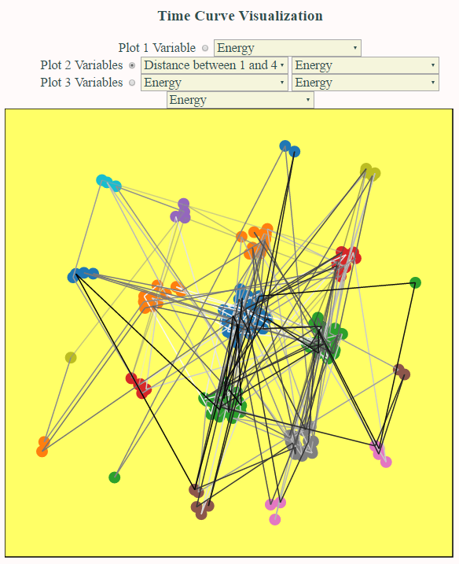

# Plotting Time Series Data From Protein Simulations Using Time Curves   
Inspired by a recent paper about [Time Curves](http://www.aviz.fr/~bbach/timecurves/), I made an interactive visualization to study data derived from protein folding simulations in my research lab. The motive of this project is to understand distributions in variables and correlations between variables that are not apparent in simple line graphs of variables changing over time. This can also be a replacement to watching protein simulation movies where keeping note of several changing variables at the same time can be a formidable task.  (You can access the final visualization [here](http://cse512-16s.github.io/a3-arushi3/) )
  
The time series data - usually energy, length of protein, distance from reference particle - is uploaded to the plotting engine. Each data point is placed on the plot at some relative distance to other points depending on their closeness with respect to a set of variables. For example, when we plot energy, two points with similar energy are plotted close together. When we plot Energy & Distance, two points with a similar combination of both variables are near each other. The line color tells the reader if the event occurs earlier or later in time - light colors for earlier time. Similar points are colored in the same color to make the graph easily readable. There are **six main forms of interaction**:  
  
* Information about each data point as you bring your mouse over   
* Paths highlight and show you their direction when you bring your mouse over  
* Zoom in and out using the touchpad or scroll keys   
* Drag the figure to focus on the areas of interest  
* Radio buttons to select number of variables for plotting   
* Drop down menus to select the variables of interest  
  

  
## Data Domain  
  This data come from a protein simulation - 4 LK-alpha 14 proteins (shown below) in water (not shown). The size of the proteins (radius of gyration), inter-protein distances, energy and other association parameters have been tracked during the simulation. This data usually fluctuates (a lot) within a range and occasionally jumps to a new state or value. Fluctuations capture the stability of the system and jumps are important to track rare-events in the simulations.  
    
  
## Reason for Choosing Time Curves  
I liked the concept of Time Curves introduced in class by Professor Heer and later read the method from [the site](http://www.aviz.fr/~bbach/timecurves/). Since the protein variables are tracked over time, I felt that this could be a good option. I believe they are better than simple line graphs since it's easier to see clusters and outliers over the entire time range. It is common in our field to use [VMD](http://www.ks.uiuc.edu/Research/vmd/) to visualize the simulation in 3D and see how the protein is evolving. It is difficult to monitor numerous variables at the same time and very difficult to keep track of similarities/differences between two time steps.  

## Storyboard  
The initial idea for making this plotting tool was to have a user send in a CSV file with time in column 1, and other parameters tracked over time in the following columns. The information from hte CSV header would then populate the drop-down menus and allow the user to select the number of variables and the types of variables from drop-down menus.  
  
Interactions like zooming in and out, and motion in the zoomed-in space would be controlled by buttons. When the mouse was brought to a data point it would show relevant information. Colors of data points would represent a cluster of points - and would change dynamically with the number of variables plotted. The paths would be of different colours to signify the time period of the points. They would shows their direction either during hover or clicking the path. The user would also be able to drag points around to make the interaction more involved - and the paths would follow the points and stay connected at all times.  

## Changes from the original storyboard  
The final implementation has data built into the code so that the viewers of this project would not have to worry about loading it- and could enjoy the interaction elements. The zooming and moving feature was implemented without buttons. The drag feature of the data points was not implemented since it was overwhelming and it would also interfere with the zoom-by-scroll feature already added to the visualization.  

## Development Process  
The project was implemented on these major fronts  
* **Multi-dimensional scaling** - In order to get the right positions of points, I first calculated a distance matrix from the CSV file. Data values were binned in 5 bins and distance between them were calculated as though they were in Euclidean space. For 2 variables, and three variables, they were treated as 2D and 3D euclidean distances, respectively. The multi-dimensional scaling algorithm was the stanbdard, classical version. Matrix calculation were conducted using the Numeric.js library.  
* **Point placement** - Since a lot of points could be overlapping, a random number generator is used to specify the angle and distance of displacement from the original location of the point. I played with the minimum distance of contact and number of iterations to come up with a decent spread of points.   
*  **Coloring** - Since lines had to be of different colors to signify their time they were broken up into segments - 1 segment between two data points and colored using a scale. The points/circles were colored according to the cluster that they fell in. Clsuters were decided by the bin system mentioned above.  
*  **Variable Selection** - Variable selectors had to be dynamic to support 1,2,3 variable plotting. The drop down menus were implemented to stay active only where the respective radio button was checked. Menu items were populated manually and updated the svg on change.
*  **Interactions**  - There were 2 mouseover ineractions - one over circles which showed the information contained in each point and increased in size and another over paths which highlighted by increasing their size and opacityand showed an arrow for direction. Zooming in by scrolling or touchpad was also implemented. 
  
Classic multi-dimensional scaling, variable selection, mouseover interactions and zooming took the least time since they were standard procedures(1-2 hours each). Obtaining the distance matrix, removing overlaps and dynamics coloring according to variables took the most time since I formulated the algorithm on my own(2-3 hrs each).
